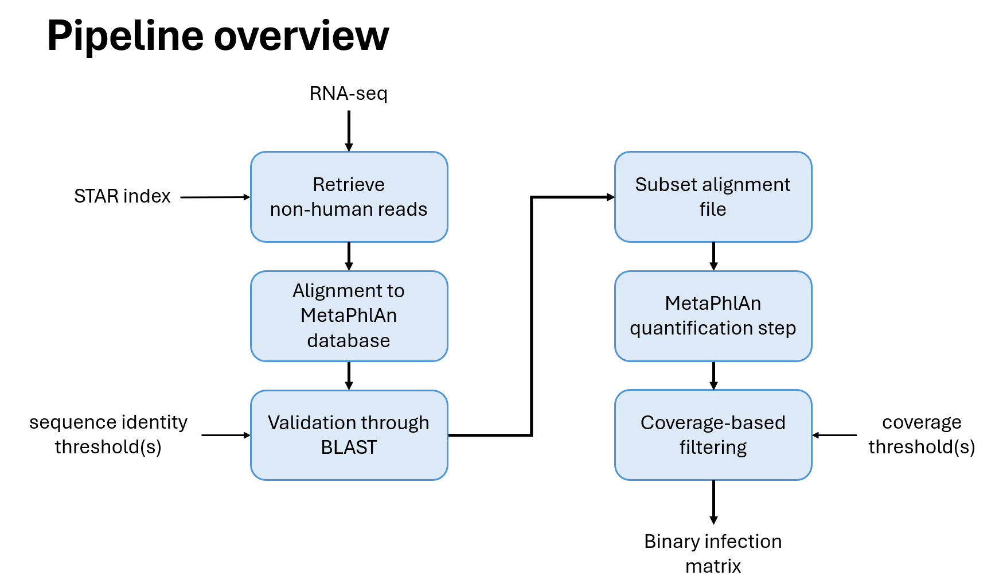

# MicrobRNA: Microbial Profiling from RNA-Seq Data

Emerging evidence highlights the
potential role of the human microbiome in cancer development and progression, with
microbial transcripts in tumor tissues offering a previously unexplored source of tumor-associated antigens. 
Here, it is presented a computational pipeline designed to detect
microbial RNAs, specifically from Archaea, Bacteria, and Fungi, in RNA sequencing data from DLBCL samples. By adapting the MetaPhlAn profiling framework to
the characteristics of short-read paired RNA-seq data, we enable a more accurate identification
of microbial taxa. In addition, downstream filtering
steps were developed to enhance the robustness of microbial predictions, with configurable
thresholds that depend on user-defined input parameters. The main goal is to systematically screen for non-human reads, enabling
the identification of potential pathogen-derived sequences associated with cancer biology,
thus expanding the repertoire of strategies for treating tumors in a more precise and
personalized manner.

The pipeline step's consist in:
  1. Alignining RNA-seq reads to the reference genome and extract non-mapping reads
  2. Aligning unmapped reads to MetaPhlAn database
  3. BLAST filtering
  4. MetaPhlAn quantification step
  5. Coverage-based filtering and plotting




---

## Requirements

- `Mamba`
- `STAR index` for the reference genome of choice
- MetaPhlAn database installation
- BLAST database installation


### To install Mamba
Go to [Miniforge installation](https://conda-forge.org/download/) and select the correct release based on your OS.
After the download is completed, run the installer in your MacOS/Linux terminal:
```bash
bash Miniforge3-Linux-x86_64.sh
```

Close and reopen your terminal to load conda, or run:
```bash
source ~/.bashrc   # or source ~/.zshrc depending on your shell
```

Finally, confirm it works:
```bash
conda --version
```

Once Miniconda is installed, install Mamba:
```bash
conda install mamba -n base -c conda-forge
```

Finally, activate the environment where other Requirements needs to be run and the pipeline itself need to be run bu doing:
```bash
mamba env create -f environment.yml
mamba activate microbRNA
```


### To index a reference genonme with STAR
After creating and activating the pipeline environment, choose the reference genome of choice. 
A complete database of genomes is [NCBI genomes website](https://www.ncbi.nlm.nih.gov/home/genomes/) where the user can both 
download directly from it (through `wget` for example) or by using the [NCBI datasets command line tool](https://www.ncbi.nlm.nih.gov/datasets/docs/v2/command-line-tools/download-and-install/)

For a better alignment of input reads to the index it is recommended to also specify the `gtf` file while creating the index.

```bash
STAR --runMode genomeGenerate --genomeDir path/to/empty/directory --runThreadN INT --genomeFastaFiles /path/to/reference.fasta --sjdbGTFfile /path/to/annotations.gtf
```


### To download a MetaPhlAn database
After creating and activating the pipeline environment, run this command to download the latest version of the MetaPhlAn database: 
```bash
metaphlan --install --bowtie2db /path/to/metaphlan-folder
```
If the user wishes to specify the database version then add `--index mpa_vJan25_CHOCOPhlAnSGB_202503`.

To run the pipeline it is also necessary to download the file that associates markers names to the species in the same directory as the metaphlan database. To do that, run
```bash
cd /path/to/metaphlan-folder
wget http://cmprod1.cibio.unitn.it/biobakery4/metaphlan_databases/mpa_vJan25_CHOCOPhlAnSGB_202503_marker_info.txt.bz2
bunzip2 mpa_vJan25_CHOCOPhlAnSGB_202503_marker_info.txt.bz2
```
If you have issues with the downloads visit the [MetaPhlAn documentation](https://github.com/biobakery/MetaPhlAn/wiki/MetaPhlAn-4)


### To download a BLAST database
We recommend the use of the core_nt database instead of all nt [(core_nt vs nt)](https://ncbiinsights.ncbi.nlm.nih.gov/2024/07/18/new-blast-core-nucleotide-database/)
```bash
mkdir core_nt
cd core_nt
update_blastdb.pl --decompress core_nt
```

---

## Usage

It requires for a conda environment to be created. Use Mamba to create the environment:
```bash
mamba env create -f environment.yml
mamba activate microbRNA
```

This pipeline works with a modified version of metaphlan that allows for paired-end alignment. Since the tool was not originally
created with this characteristics, we also added a , to be able to use paired-end metaphlan it is necessary to copy this version on the conda directory, by running:
```bash
cp metaphlan.py $CONDA_PREFIX/lib/python3.7/site-packages/metaphlan/metaphlan.py
```

Or, if you do not want to remove complitely the original version of metaphlan:
```bash
cp metaphlan.py $CONDA_PREFIX/lib/python3.7/site-packages/metaphlan/paired-metaphlan.py
cd $CONDA_PREFIX/lib/python3.7/site-packages/metaphlan
mv metaphlan.py original-metaphlan.py
mv paired-metaphlan.py metaphlan.py 
```

Now everything is ready to run the pipeline!

---

The pipeline needs 4 required parameters in input:
```text
 --star-index DIR        A directory of paired-end FASTQ files, named with `_R1.fastq.gz` and `_R2.fastq.gz` suffixes
 --fastq-dir DIR         A STAR genome index directory
 --mpa-dir DIR           Path to the installed MetaPhlAn database
 --blast-dir DIR         Path to the installed BLAST database
```

```text
bash pipeline.sh --star-index /path/to/genome/index --fastq-dir /path/to/fastq/files --mpa-dir path/to/metaphlan/database --blast-dir path/to/blast/database [options]
```

### All arguments
```text
Required arguments:
  -n, --star-index DIR      Path to the STAR reference genome index directory.
  -i, --fastq-dir DIR       Directory containing input FASTQ files.
  -d, --mpa-dir DIR         Path to the MetaPhlAn database.
  -b, --blast-dir DIR       Path to the BLAST database.

Optional arguments:
  -c, --coverage N          Percentage of coverage to consider a marker as positive. [default: (30 40)]
  -l, --blast-index STR     Name of BLAST database. [default: core_nt]
  -x, --mpa-index STR       Version of the MetaPhlAn database. [default: mpa_vJan25_CHOCOPhlAnSGB_202503 (latest)]
  -t, --threads N           Number of threads to use. [default: 8]
  -u, --unmapped-dir DIR    Directory where to store unmapped reads on reference genome. [default: ./unmapped_reads]
  -w, --working-dir DIR     Directory where intermediate files and output files will be store. [default: .]
  -o, --outdir DIR          Directory storing output files. [defaults: ./results]
  -s, --seq-identity N      Sequence identity threshold for considering a read human if blasted on a sequence. [default: (98 80) ]
  -h, --help                Show this help message and exit.

```

---

## Output
A binary infection matrix, where in each cell _(i, j)_ the value is `1` if the sample _i_ is infected by the species _j_.

One binary matrix is output for each combination of blast-sequence-identity-threshold and coverage-threshold in input.

Also, a `plots` directory is created that contains as many subdirectories as the combinations of the 2 input parameteres, each containing the precomputed plots
on the corresponding output binary matrix. Each subdirectory is called `si{sequence-identity-threshold}-cov{coverage-threshold}`
